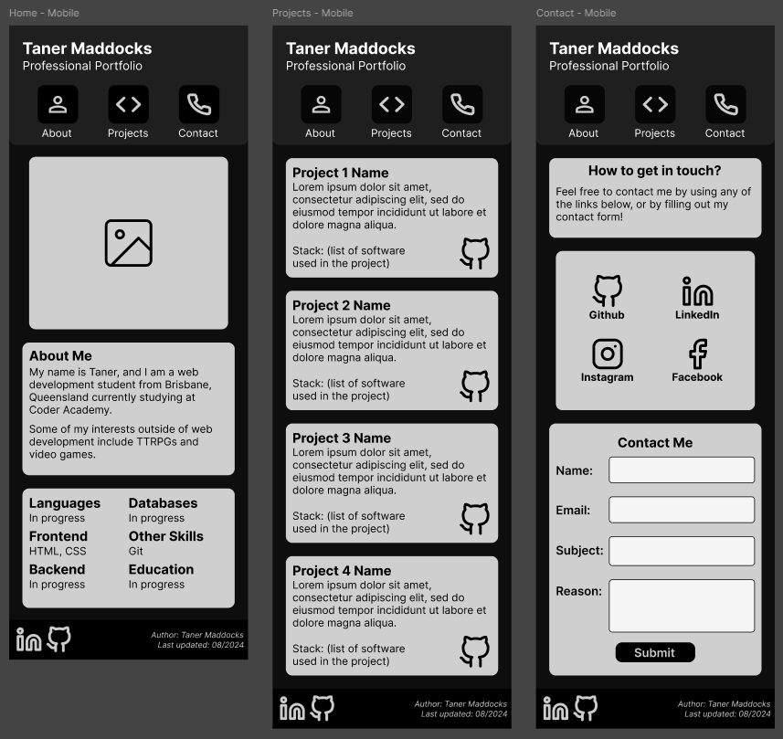
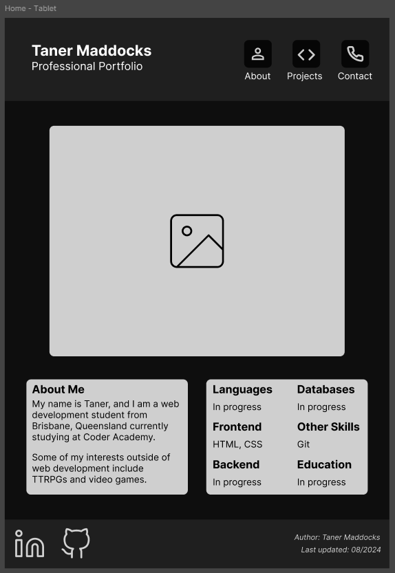
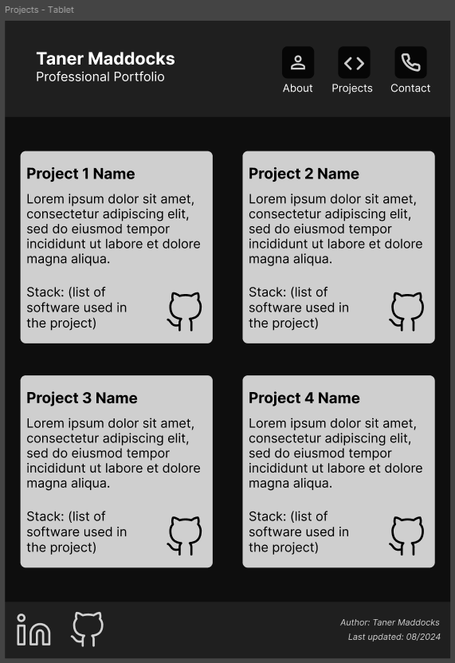
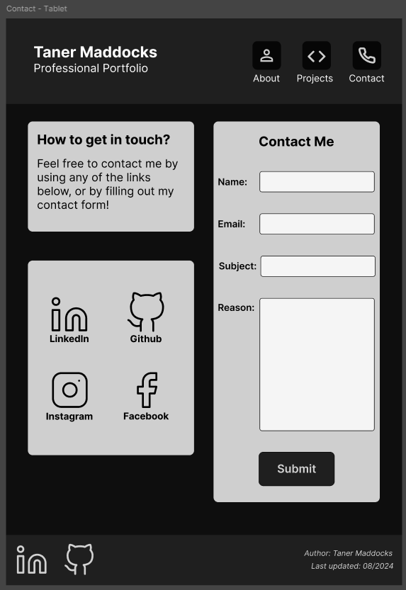
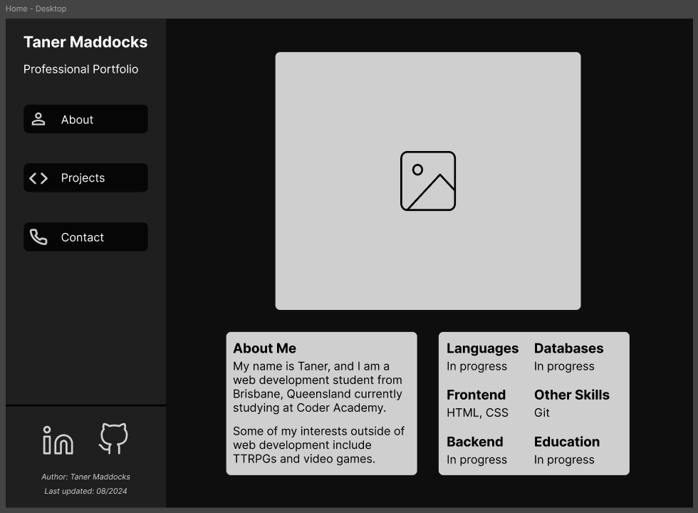
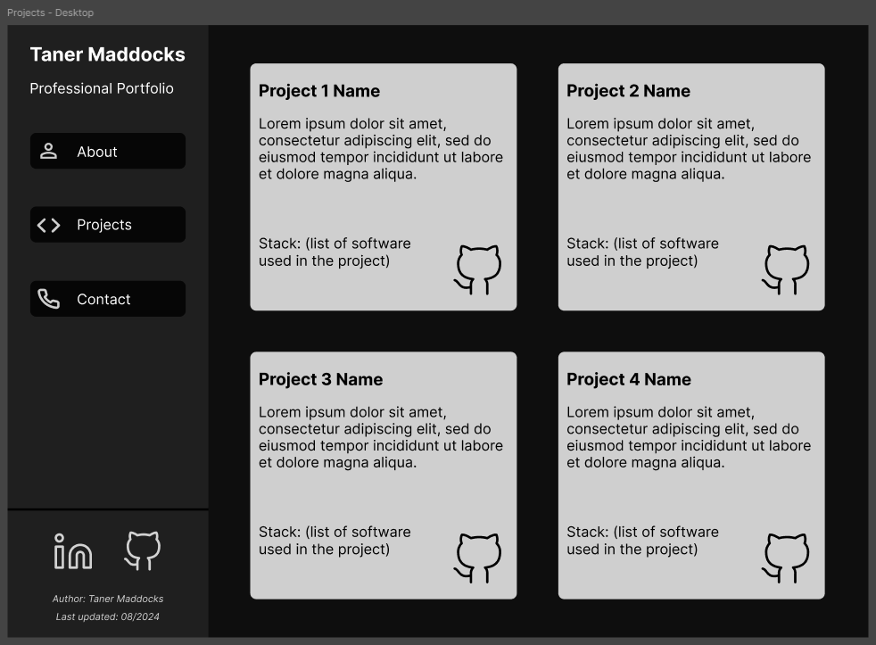
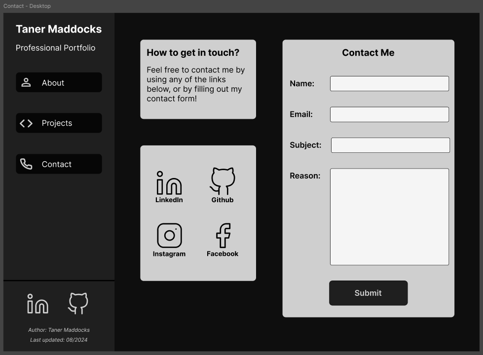

# Assignment 1: Website Design Layout

## Website Content

All pages on my portfolio consists of three main sections, being the header, the main, and the footer, this remains consistent across all screen sizes. As of this assignment's submission, the plan is to structure these three sections using flexbox.  

In terms of their content, the header and the footer don't change between the three pages. All the styling for the header and footer comes from the index.css file.
- The header consists of the title and subtitle for the page (the title block), and the navbar. For the mobile section, the nav bar sits in a row underneath the title block.  
- The footer section contains links to my GitHub profile and my LinkedIn profile and on the right of that is an author credit and a last updated entry.  

All the content for the website is contained in the main section, and each page contains a portion of the information requested by the assignment brief.
- The About page, otherwise referred to as the home page, will be contained in the index.html file and will have styling from the index.css and the about.css files. This page contains (quoting the brief):
    - "An introduction or information about you."
    - "Your work-relevant skills."
        - Because I don't yet have many work-relevant skills, many parts will have "In progress".

- The Projects page will be contained in the projects.html file and will have styling from the index.css and the projects.css files. This page contains:
    - "Your work or project history."
        - Because I haven't worked on any projects or worked in the web development industry before, these will all be placeholders. 
    - Each project has a title, a short description, a stack list, and a link to the project's GitHub page. The title is a link to the project itself.
    - This page is going to use CSS grid, as opposed to flexbox.
        
- The Contact page will be contained in the contact.html file and will have styling from the index.css and contact.css files. This page contains:
    - "At least one (1) way for potential employers or recruiters to contact you."
    - This page will have both a contact form and a set of links that will take you to my work-relevant social medias.

<div style="page-break-after: always;"></div>

## Mobile Wireframes

The Mobile pages will be the default display for the website. Changes will occur when moving to larger screens using standard breakpoints and;
```css
@media only screen and (min-width: 576px)
```
For the mobile site, the major features are;
- The header's position will be sticky.
- The navbar sits underneath the title block.
- On the projects page the projects are in one column.
- Unlike on the tablet and desktop, scrolling is needed to see all content.

## Tablet Wireframes

Major features of the tablet site are;
- The navbar sits to the right of the title block.
- Projects page now contains 2 columns and 2 rows.
- Font sizes are larger, and many elements are scaled up.

## Desktop Wireframes

On the desktop site, major features are;
- Navbar button frames include the text, hover will change colour and increase scale slightly.
- Navbar is underneath the title block and the footer is inline with header. Main content takes majority of screen.
- Footer layout changed slightly.

  


<!-- 

 -->


<!-- 

 -->


